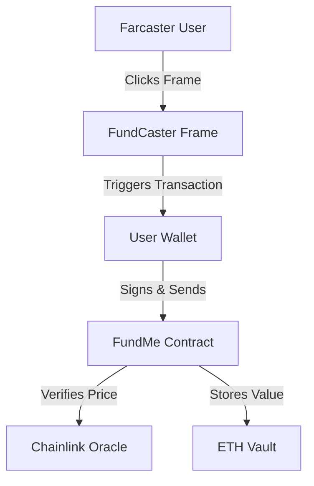

# 🎩 FundCaster

> **Crowdfunding for the Farcaster Era.**
> A decentralized, frame-native mini-app allowing creators to raise funds directly on Warpcast.


## 📖 Overview

**FundCaster** transforms the crowdfunding experience by removing friction. Instead of navigating to external websites, connecting wallets, and signing transactions, users can fund their favorite projects with **1-click** directly from their social feed via Farcaster Frames.

## ✨ Features

- **Micro-Grants & Tipping**: Optimized for small, frequent transactions (min $5 USD).
- **Price Feeds**: Real-time ETH/USD conversion using Chainlink Price Feeds.
- **Efficient Withdrawals**: Batch withdrawal logic to save gas for project owners.
- **Visual Feedback**: Real-time progress tracking within the Frame (Coming Soon).

## 🏗️ Architecture



## 🛠️ Tech Stack

- **Smart Contracts**: Solidity v0.8.18, Foundry
- **Network**: Base Sepolia (L2), Ethereum Sepolia (L1)
- **Oracle**: Chainlink Data Feeds
- **Frontend (Phase 2)**: Next.js, RainbowKit, Wagmi
- **Frames (Phase 3)**: OnchainKit

## 🚀 Getting Started

### Prerequisites

- [Foundry](https://book.getfoundry.sh/getting-started/installation) installed
- [Git](https://git-scm.com/downloads) installed

### Installation

```bash
# 1. Clone the repository
git clone https://github.com/YOUR_USERNAME/fund-caster.git
cd fund-caster

# 2. Install dependencies
make install

# 3. Setup Environment
# Create a .env file with SEPOLIA_RPC_URL, PRIVATE_KEY, and ETHERSCAN_API_KEY
```

## 💻 Usage

We use `Make` to simplify common commands.

### Build
Compile the smart contracts:
```bash
make build
```

### Test
Run the comprehensive test suite:
```bash
make test
```

### Deploy
Deploy to Sepolia Testnet (Requires .env):
```bash
make deploy-sepolia
```

## 🤝 Contributing

Contributions are welcome! Please open an issue or submit a PR.

## 📄 License

This project is licensed under the MIT License.
